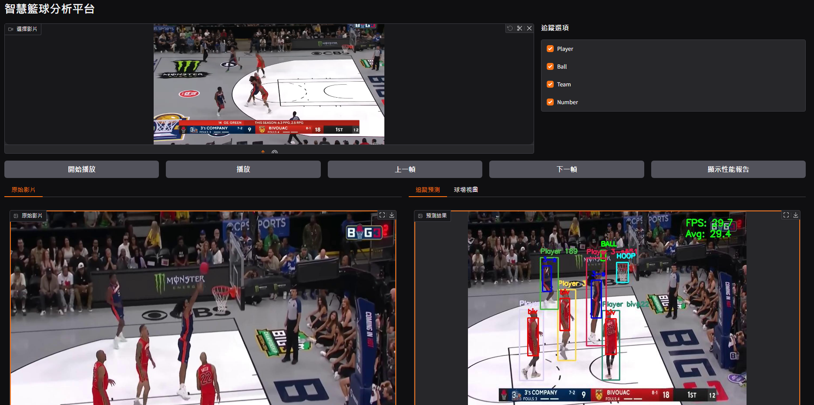
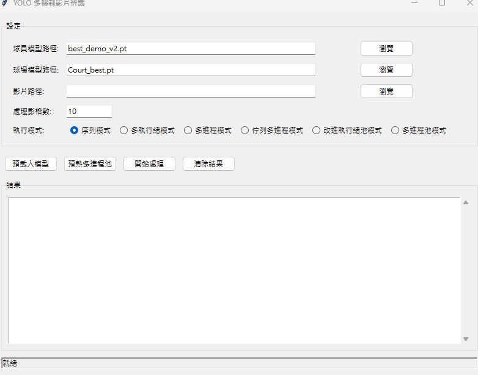
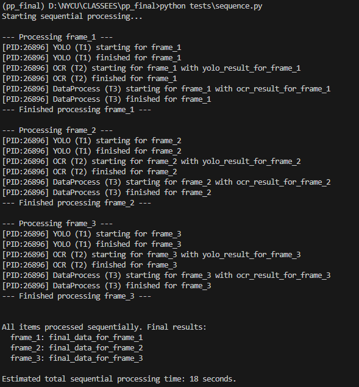
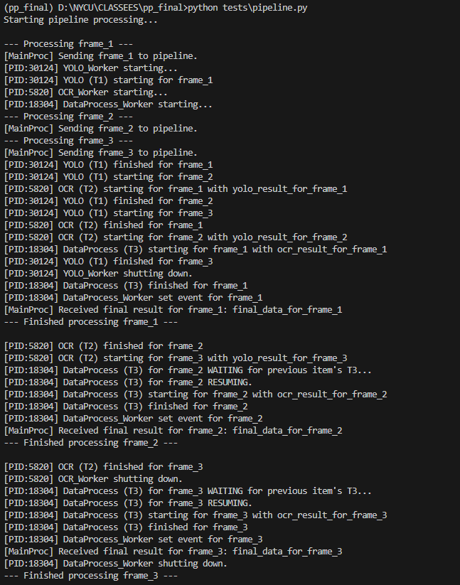
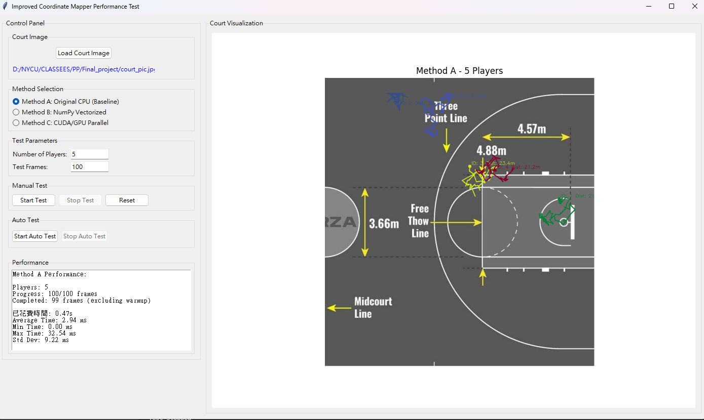

# 籃球影像分析系統平行運算優化研究

## 測試環境

- **作業系統**：Windows 11
- **開發平台**：Visual Studio Code 
- **Python**：3.12
- **CPU**：AMD Ryzen 7 7700 8-Core處理器，基礎時脈3.8GHz
- **CUDA**：11.8 或 12.x（用於 GPU 加速）
- **記憶體**：64GB 
- **顯示卡**：NVIDIA GeForce RTX 4070 Ti Super 16GB

## 安裝步驟

### 1. 建立 Conda 環境

```bash
# 建立新的 conda 環境
conda create -n pp_final python=3.12

# 啟動環境
conda activate pp_final
```

### 2. 安裝其他依賴套件

```bash
# 安裝基本套件
pip install -r requirements.txt
```

### 3. 安裝 PyTorch（CUDA 版本）

```bash
# 先完全卸載現有的 PyTorch 相關套件
pip uninstall torch torchvision torchaudio -y

# 重新安裝 CUDA 11.8 版本（確保完整支援）
pip install torch==2.2.1 torchvision==0.17.1 torchaudio==2.2.1 --index-url https://download.pytorch.org/whl/cu118

# 或為 CUDA 12.6 安裝 PyTorch
# pip install torch torchvision torchaudio --index-url https://download.pytorch.org/whl/cu126
```

### 4. 安裝 PaddlePaddle GPU 版本

```bash
pip install paddleocr==2.10.0 paddlepaddle-gpu==2.6.2 -i https://pypi.tuna.tsinghua.edu.cn/simple
```

### 5. 驗證安裝

```bash
# 檢查 CUDA 是否可用
python -c "import torch; print(f'CUDA available: {torch.cuda.is_available()}')"

# 檢查 PaddleOCR
python -c "from paddleocr import PaddleOCR; print('PaddleOCR installed successfully')"
```

## 專案結構

```
├── main.py                          # 主程式入口
├── models/
│   ├── basketball_tracker.py        # 核心追蹤器（包含平行化實作）
│   ├── coordinate_mapper.py         # 座標映射
│   ├── court_analyzer.py            # 球場分析
│   ├── number_recognizer.py         # 號碼識別
│   └── scoring_analyzer.py          # 得分分析
├── ui/
│   └── gradio_interface.py          # 網頁介面
├── utils/
│   ├── data_manager.py              # 資料管理
│   ├── image_processing.py          # 影像處理
│   └── visualization.py             # 視覺化工具
├── tests/
│   ├── sequence.py                  # 序列處理測試
│   ├── pipeline.py                  # Pipeline 處理測試
│   ├── multi_yolo_video_thread.py   # 多執行緒測試
│   ├── coordinate_parallel_test.py  # 座標計算平行化測試
│   └── test_cuda.py                 # 檢查CUDA程式
├── big3_data/                       # 球員資料目錄
├── best_demo_v2.pt                  # 球員偵測模型
├── Court_best.pt                    # 球場偵測模型
├── court_pic.jpg                    # 球場參考圖
└── final_demo.mp4                   # 測試影片
```

## 使用方法

### 1. 啟動主應用程式

```bash
# 啟動完整的籃球分析系統
python main.py
```

系統會啟動 Gradio 網頁介面，可在瀏覽器中訪問進行影片分析。
點選 Running on local URL: http://127.0.0.1:7860

## 籃球分析系統


## 測試與實驗

### 1. 多執行緒效能測試

```bash
# 啟動多執行緒效能測試 GUI
python tests\multi_yolo_video_thread.py

# 啟動多執行緒效能測試 GUI 搭配視覺化分析
viztracer tests\multi_yolo_video_thread.py
```

**測試項目**：
- 序列模式 (MODE_SERIAL = 0)
- 多執行緒模式 (MODE_THREADING = 1) 
- 多進程模式 (MODE_MULTIPROCESS = 2)
- 佇列多進程模式 (MODE_QUEUE = 3)
- 改進執行緒池模式 (MODE_IMPROVED_THREADING = 4)
- 多進程池模式 (MODE_MP_POOL = 5)

**操作步驟**：
1. 選擇球員模型路徑：請選擇目錄下 `best_demo_v2.pt`
2. 選擇球場模型路徑：請選擇目錄下 `Court_best.pt`
3. 選擇測試影片：請選擇目錄下 `final_demo.mp4`
4. 設定處理影格數
5. 選擇執行模式
6. 點擊「開始處理」

## 多執行緒效能測試UI


### 2. 序列 vs Pipeline 處理比較

```bash
# 測試序列處理
python tests\sequence.py
viztracer tests\sequence.py

## 序列處理


# 測試 Pipeline 處理
python tests\pipeline.py
viztracer tests\pipeline.py
```

## Pipeline 處理


### 3. 座標計算平行化測試

```bash
# 啟動座標計算平行化測試
python tests\coordinate_parallel_test.py
```

**測試項目**：
- Method A：原始 CPU 處理
- Method B：NumPy 向量化處理  
- Method C：CUDA GPU 並行處理（需要 CuPy）

**操作步驟**：
1. 載入球場圖片：請選擇目錄下 `court_pic.jpg`
2. 設定球員數量
3. 設定測試幀數
4. 選擇測試方法
5. 點擊「Start Test」進行手動測試
6. 或點擊「Start Auto Test」進行自動化測試

## 座標計算平行化測試UI


### 4. CUDA 環境檢測

```bash
# 檢查 CUDA 環境
python tests\test_cuda.py
```

## 效能分析工具

### VizTracer 視覺化分析

```bash
# 安裝 VizTracer（已經包含在 requirements.txt）
pip install viztracer

# 分析序列處理
viztracer --output_file sequence_trace.json tests\sequence.py

# 分析 Pipeline 處理  
viztracer --output_file pipeline_trace.json tests\pipeline.py

# 開啟分析結果
vizviewer path_to\sequence_trace.json
vizviewer path_to\pipeline_trace.json
```

## 常見問題

### 1. CUDA 相關錯誤

```bash
# 檢查 CUDA 版本
nvidia-smi

# 重新安裝對應版本的 PyTorch
pip uninstall torch torchvision torchaudio -y
pip install torch torchvision torchaudio --index-url https://download.pytorch.org/whl/cu118
```

### 2. PaddleOCR 錯誤

```bash
# 如果遇到 PaddleOCR 安裝問題
pip uninstall paddleocr paddlepaddle-gpu -y
pip install paddlepaddle-gpu -i https://pypi.tuna.tsinghua.edu.cn/simple
pip install paddleocr -i https://pypi.tuna.tsinghua.edu.cn/simple
```

## 授權

此專案僅供學術研究使用。